# 机械臂控制

[English Version](./README_EN.md)

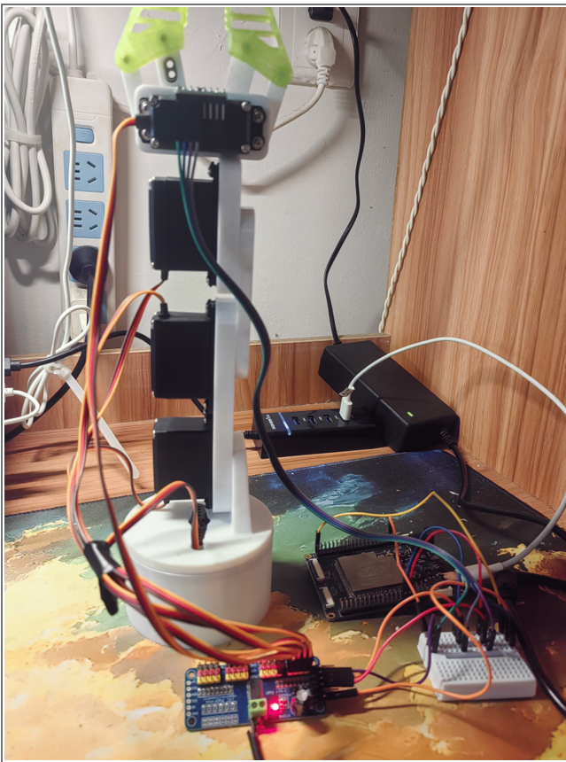

## 项目简介

面向行动不便者自主取物需求，本作品以 **ESP32-P4** 为主控、四自由度舵机机械臂为载体，实现 **手机 IMU 体感遥控**——手持手机翻转倾斜，机械臂 WiFi 实时跟随，零门槛操作，浏览器控制无需 App。末端 **MPU6050** 构建 **PID 闭环**，毫秒级修正末端 pitch 防倾翻。内置 **逆运动学** 坐标驱动一键抓取。体感与坐标双模式互补，三层架构为辅助生活提供工程实践。

## 快速开始

1. 安装 [ESP-IDF v5.5.4](https://docs.espressif.com/projects/esp-idf/en/v5.5.4/esp32p4/get-started/index.html)
2. 克隆并配置：
   ```bash
   git clone <你的仓库地址>
   cd Robot_Arm
   idf.py reconfigure
   ```
3. 获取 C5 协处理器固件（详见下方[协处理器固件](#协处理器固件)说明），然后编译烧录：
   ```bash
   # 先设置 slave 固件（见下方说明）
   cd slave && idf.py set-target esp32c5 && idf.py reconfigure build flash && cd ..
   idf.py build flash monitor
   ```
4. 手机连接 WiFi `Arm_AP`（密码 `12345678`），浏览器打开 `http://192.168.4.1`

> **修改密码**：在 `main/main.c` 中修改 `WIFI_SSID`/`WIFI_PASSWORD`，或在编译时传入 `-DWIFI_SSID=...`。

### 系统架构


- **ESP32-P4 主控 (Host)**：运行控制逻辑、Web 服务器和 IMU 反馈处理
- **ESP32-C5 协处理器**：通过 SDIO 连接，提供 WiFi 功能（ESP-Hosted 模式）
- **手机 IMU**：通过 WebSocket 发送手机姿态数据作为目标输入
- **MPU6050**：安装在机械臂末端，测量实际姿态用于 PID 闭环反馈
- **PCA9685**：I2C 16通道 12位 PWM 驱动芯片，控制 5 路舵机

### 控制模式

- **模式 0（手动）**：通过 Web 界面滑块控制
- **模式 1（手机 IMU + PID）**：手机 IMU 体感控制 + MPU6050 末端 PID 闭环修正

### 任务结构

| 任务 | 频率 | 职责 |
|------|------|------|
| IMU_Feedback_Task | 100Hz | 末端 MPU6050 反馈数据采集，互补滤波融合 |
| Control_Task | 50Hz | PID 闭环控制 + 命令生成，驱动 IMU 模式 |
| Servo_Task | 50Hz | 舵机指令执行，I2C 锁协调 |
| WebStatus_Task | 20Hz | Web 状态发布，WebSocket 推送 |

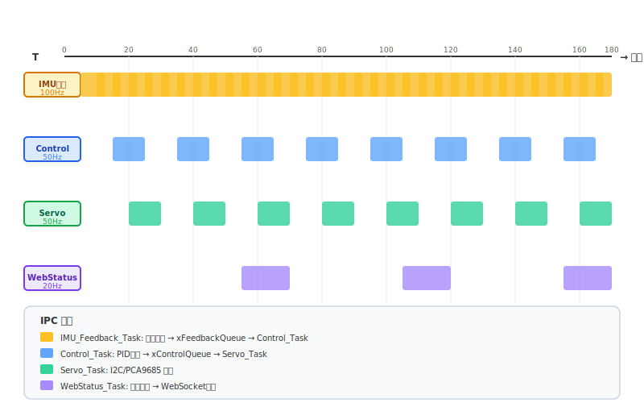

## 硬件

### 开发板

WTDKP4C5-S1-1V1（ESP32-P4 + ESP32-C5）

### 舵机通道（5 路）

| 通道 | 功能 | PCA9685 引脚 | 角度范围 |
|------|------|-------------|---------|
| 0 | 底座旋转 (J0) | PWM0 | 0-180° |
| 1 | 肩关节 (J1) | PWM1 | 60-120° |
| 2 | 肘关节 (J2) | PWM2 | 40-140° |
| 3 | 腕关节 (J3) | PWM3 | 20-160° |
| 4 | 夹爪 | PWM4 | 0°(张开) - 90°(闭合) |

### 引脚连接

#### ESP32-P4 主控侧

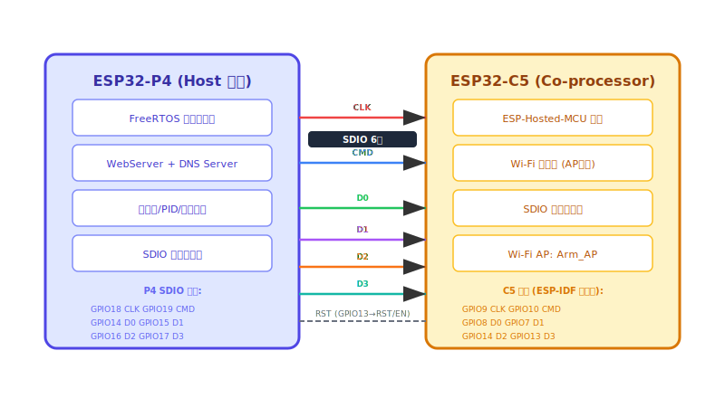

| 引脚 | 功能 | 连接对象 |
|------|------|---------|
| GPIO51 | I2C SDA | PCA9685 SDA, MPU6050 SDA |
| GPIO52 | I2C SCL | PCA9685 SCL, MPU6050 SCL |
| GPIO18 | SDIO CLK → C5 | ESP32-C5 CLK (GPIO9) |
| GPIO19 | SDIO CMD → C5 | ESP32-C5 CMD (GPIO10) |
| GPIO14 | SDIO D0 → C5 | ESP32-C5 D0 (GPIO8) |
| GPIO15 | SDIO D1 → C5 | ESP32-C5 D1 (GPIO7) |
| GPIO16 | SDIO D2 → C5 | ESP32-C5 D2 (GPIO14) |
| GPIO17 | SDIO D3 → C5 | ESP32-C5 D3 (GPIO13) |
| GPIO13 | SDIO 从复位 → C5 | ESP32-C5 RST/EN |

#### ESP32-C5 协处理器侧

SDIO 引脚由 ESP-IDF 硬编码（ESP32-C5 不可更改）：

| 信号 | C5 GPIO |
|------|---------|
| CLK | GPIO9 |
| CMD | GPIO10 |
| D0 | GPIO8 |
| D1 | GPIO7 |
| D2 | GPIO14 |
| D3 | GPIO13 |

### I2C 配置

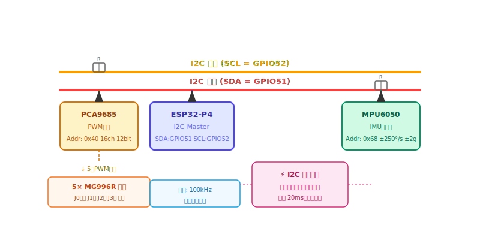

- **总线**: I2C_NUM_0
- **SDA**: GPIO51
- **SCL**: GPIO52
- **频率**: 100kHz
- **设备**:
  - PCA9685 舵机驱动（I2C 地址: 0x40）
  - MPU6050 IMU（I2C 地址: 0x68，备用: 0x69）

### BOM 清单

| 组件 | 数量 | 说明 |
|------|------|------|
| WTDKP4C5-S1-1V1 开发板 | 1 | ESP32-P4 + ESP32-C5 |
| 舵机（MG996R，180°） | 4 | J0=底座、J1=肩、J2=肘、J3=腕 |
| 舵机（MG996R，夹爪用） | 1 | 0°-90°（无需 180°） |
| PCA9685 模块 | 1 | I2C PWM 驱动，地址 0x40 |
| MPU6050 模块 | 1 | 末端 I2C IMU，地址 0x68 |
| 杜邦线 | 若干 | 面包板接线用 |
| 小面包板 | 1 | 免焊接，快速搭建 |
| Micro USB 线 | 1 | P4 供电和串口打印 |
| 电源 | 1 | 推荐 5V/2A+（舵机供电） |
| WiFi 天线 | 1 | C5 模块使用 |
| USB 转串口烧录器 | 1 | 用于烧录 C5 固件 |

## 软件

### 构建系统

- **ESP-IDF**: v5.5.4
- **目标**: ESP32-P4 (Host) + ESP32-C5 (协处理器)

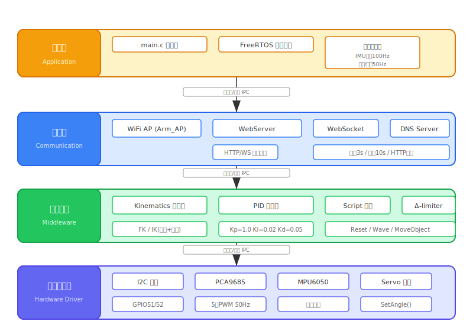

### 编译与烧录

开发板包含**两颗芯片**，通过 SDIO 连接。**必须先烧录 C5**（它提供 WiFi 功能给 P4 使用）。

```bash
# 第一步：获取并烧录 ESP32-C5 协处理器固件（WiFi 芯片）
# 详见下方 [协处理器固件](#协处理器固件) 中的设置说明
cd slave && idf.py set-target esp32c5 && idf.py reconfigure build flash && cd ..

# 第二步：烧录 ESP32-P4 主控固件（主控制器）
idf.py reconfigure build flash monitor
```

或使用提供的批处理脚本：

```cmd
build_now.bat            # 编译并烧录 P4 固件
```

### 协处理器固件

ESP32-C5 协处理器固件使用官方 [ESP-Hosted-MCU](https://github.com/espressif/esp-hosted-mcu) 项目，由乐鑫官方维护。**该目录未提交到仓库中**，需要自行获取后才能编译。

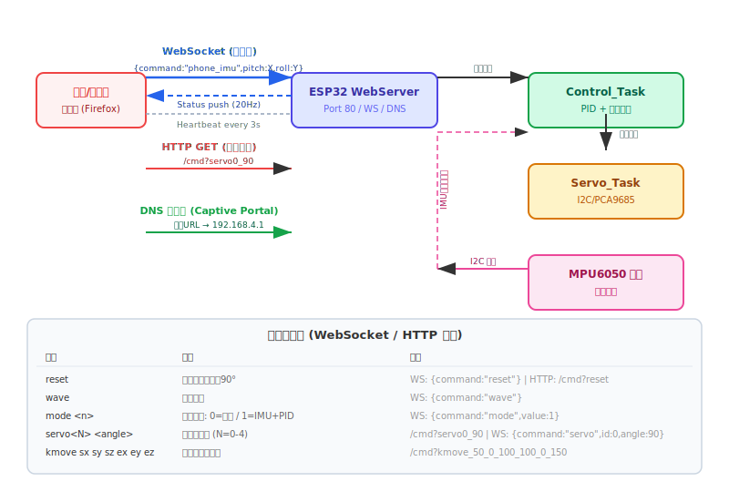

#### 获取并设置 Slave 固件

```bash
# 克隆官方 ESP-Hosted-MCU 仓库
git clone https://github.com/espressif/esp-hosted-mcu.git

# 将 slave 固件目录复制到本项目
cp -r esp-hosted-mcu/slave .
cd slave
```

Slave 固件使用 IDF Component Manager（见 [`slave/main/idf_component.yml`](slave/main/idf_component.yml)）。首次编译会自动从组件注册中心（iperf、wifi-cmd、ping-cmd、mqtt）下载依赖，请确保联网。

> **为什么先烧录 C5？** P4 主控通过 ESP-Hosted 模式访问 WiFi，依赖 C5 芯片。若 C5 无固件，P4 无法初始化 WiFi。C5 通过固定 SDIO 引脚连接，P4 启动前 C5 必须已有有效固件。

### 项目结构

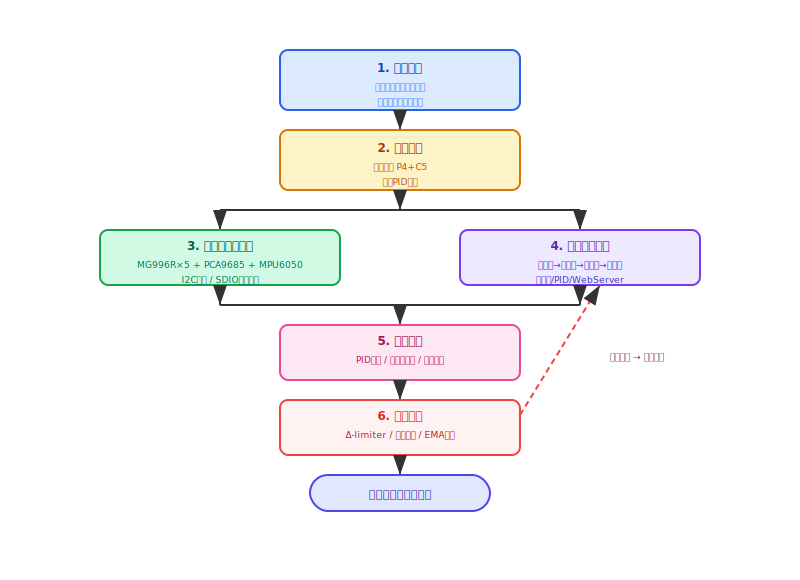

```
.
├── main/                      # 主程序
│   ├── main.c                 # 程序入口、任务定义
├── components/
│   ├── Hardware/              # 硬件驱动
│   │   ├── I2C/               # I2C 主机驱动
│   │   ├── PCA9685/           # 舵机驱动 (PWM)
│   │   ├── MPU6050/           # IMU 驱动 (传感器融合)
│   │   └── Servo/             # 舵机抽象层
│   ├── Middleware/            # 业务逻辑
│   │   ├── Kinematics/        # 正逆运动学求解器
│   │   └── Script/            # 脚本动作（搬运、挥手、归位）
│   └── Communication/         # 通信栈
│       ├── WiFi/              # WiFi AP 配置
│       └── WebServer/         # HTTP + WebSocket 服务器
└── slave/                     # ESP32-C5 协处理器固件（未提交；详见上方获取说明）
```

## Web 界面

连接 WiFi 热点 `Arm_AP`（密码：`12345678`），浏览器打开 `http://192.168.4.1`。

无需安装任何 App，直接通过网页即可控制机械臂。页面实时显示各关节角度、IMU 姿态、PID 误差等状态信息。

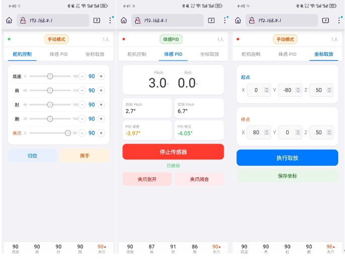

### 控制命令

| 命令 | 说明 |
|------|------|
| `reset` | 全部舵机归位到 90° |
| `wave` | 挥手动画（肘关节 J2 摆动 3 次） |
| `mode` | 切换模式：0=手动 / 1=IMU+PID |
| `servo0-4` | 设置单个舵机角度（0-180°） |
| `gripper_open` / `gripper_close` | 夹爪开/关 |
| `kinematic_move` | 使用默认坐标搬运物体 |
| `kmove sx sy sz ex ey ez` | 自定义坐标搬运物体 |
| `phone_pitch` | 目标俯仰角（IMU 模式） |
| `phone_roll` | 目标横滚角（IMU 模式） |

## PID 闭环控制

模式 1（手机 IMU + PID）下：

- **俯仰角 (Pitch)**：手机 IMU 目标俯仰 → 映射舵机角度 → MPU6050 末端俯仰反馈 → 通过雅可比伪逆对 J1/J2/J3 进行 PID 修正
- **横滚角 (Roll)**：手机 IMU 横滚 → 直接映射底座旋转 (J0)，无需 PID（底座旋转不改变 MPU6050 横滚）
- **夹爪**：独立 Web 命令控制

### PID 参数

- **Kp**: 1.0
- **Ki**: 0.02
- **Kd**: 0.05
- **积分限幅**: 30.0
- **输出限幅**: 15.0
- **雅可比增益**: 0.8

### PID 设计要点

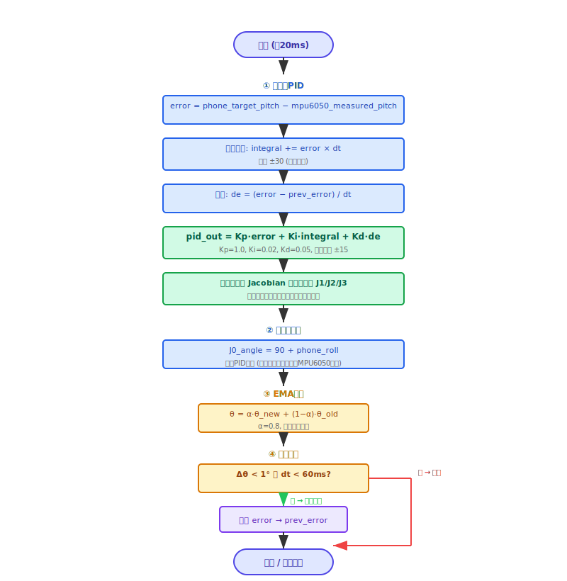

- **积分抗饱和**：积分项限制在 ±30.0，防止长时间误差导致积分溢出
- **微分滤波**：微分项抑制高频噪声，避免舵机抖动
- **雅可比伪逆分配**：将末端 pitch 误差按各关节对 pitch 的偏导比例分配到 J1/J2/J3，而非简单等分
- **平滑滤波**：控制输出经过 0.8 系数的指数滑动平均滤波，减少舵机冲击
- **防抖机制**：角度变化小于 1° 或间隔不足 60ms 时不发送指令，降低 I2C 总线负载

### I2C 总线信号量锁协调

所有任务（IMU_Feedback、Control、Servo）共享同一 I2C 总线（SDA=GPIO51, SCL=GPIO52）。通过互斥信号量协调访问：IMU_Feedback_Task 获取锁读取 MPU6050，Servo_Task 获取锁写入舵机指令。若锁被占用，指令会排队而非丢弃，20ms 超时防止锁饥饿。消除了并发 IMU 读取和舵机写入之间的 I2C 冲突。

### Δ-limiter（陀螺仪符号翻转保护）

手机陀螺仪在 ±90° 附近会出现符号翻转伪影（-89° → +89°），导致底座角度单帧跳变 178°。系统内置 Δ-limiter 机制：任何一帧的 roll 变化超过 170° 时直接丢弃，保持上一帧角度。防止体感控制时底座剧烈甩动。

### HTTP 回退机制

当 WebSocket 连接断开时（如浏览器标签页后台运行、WiFi 抖动），Web UI 自动降级为 HTTP GET 请求（`/cmd?X_90`）发送舵机指令。服务器支持完整命令集（`reset`、`wave`、`mode`、`gripper_open`、`gripper_close`、`kinematic_move`、`kmove`、`phone_pitch`/`phone_roll`），确保连接降级后控制不中断。

### 门户重定向 DNS

板载 DNS 服务器监听 53 端口，将所有 A 记录查询解析为 `192.168.4.1`。手机连接 `Arm_AP` 后，浏览器中打开任意 URL（如 `example.com`）都会重定向到控制页面。无需记住 IP 地址——连接 WiFi 后打开任意网址即可。

### Web UI — 三栏 Tab 设计

Web 界面分为三个功能栏：

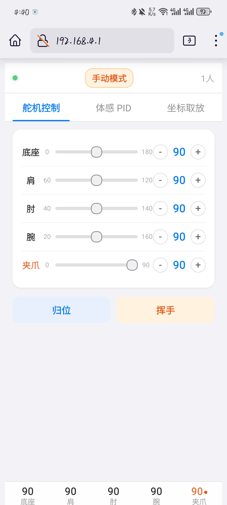

- **舵机控制**：五个通道滑条（底座/肩/肘/腕/夹爪），带 +/- 按钮，快捷操作按钮（归位、挥手、夹爪开/关）

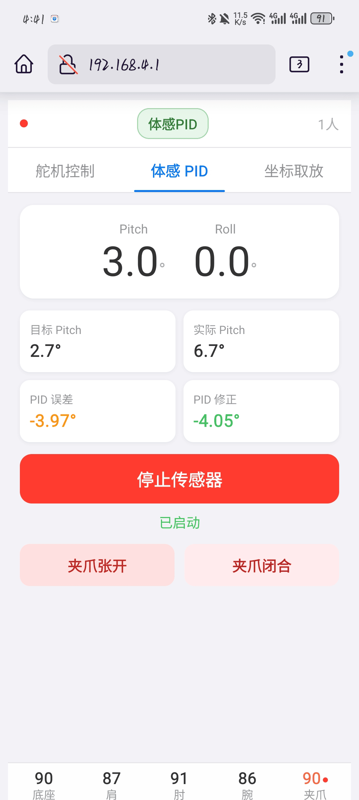

- **体感 PID**：实时 pitch/roll 显示，目标 vs 实际 pitch，PID 误差/修正值，支持 DeviceOrientation API 及 DeviceMotion 重力加速度降级方案

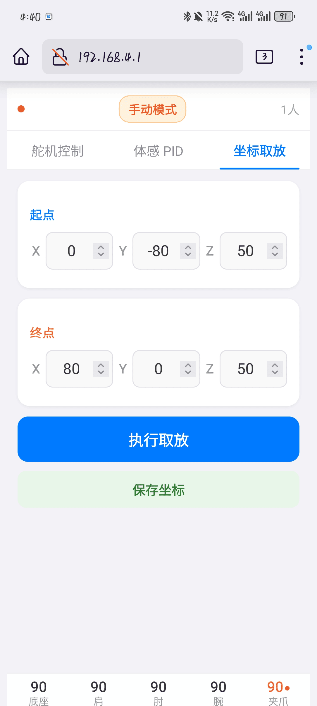

- **坐标取放**：起点/终点坐标输入（X/Y/Z），一键执行逆运动学取放动作，支持坐标预设保存到浏览器 localStorage

### 鲁棒性与工程细节

- **指数滑动平均滤波**：所有舵机输出经过 α=0.8 的 EMA 滤波，平滑指令过渡
- **死区机制**：角度变化 <1° 或间隔 <60ms 的指令静默丢弃，降低 I2C 总线负载和舵机磨损
- **Δ-limiter**：roll/pitch 单帧变化 >170°（陀螺仪符号翻转伪影）自动丢弃，保持上一帧角度
- **I2C 信号量锁+超时**：并发 IMU 读取和舵机写入互不冲突；队列指令按序执行
- **WebSocket 自动重连**：指数退避（3s → 最大 30s），标签页恢复/聚焦时自动重连，心跳超时（10s）断开空闲客户端
- **Captive Portal DNS**：所有 DNS 查询解析为 `192.168.4.1`，连接 WiFi 后打开任意网址即显示控制页
- **HTTP 回退**：WebSocket 不可用时，所有指令可通过 `/cmd` HTTP GET 执行，兼容 ESP8266 命令协议

### 浏览器与传感器说明

- **自动跳转**：连接 `Arm_AP` 后打开任意网址会自动重定向到控制页（由板载 DNS 实现）。
- **手机 IMU 需要 HTTPS 或 localhost**：`DeviceOrientationEvent.requestPermission()` 仅对 HTTPS 源可用。由于设备 AP 使用 `http://192.168.4.1` 服务，iOS Safari（iPhone 13+）会阻止传感器访问。
- **推荐使用 Firefox**：在手机安装 Firefox 浏览器并打开 `http://192.168.4.1`，Firefox 不需要权限请求即可使用设备方向传感器，在 iOS 和 Android 上均可靠工作。
- **备选方案**：Chrome 在 Android 上可以正常使用 IMU。iOS 用户强烈建议使用 Firefox。

## 运动学

### 坐标系

- 原点：底座中心 (0, 0, 0)
- X轴：向前，Y轴：向右，Z轴：向上
- 关节角度：0-180°

### 臂长参数

| 参数 | 数值 | 说明 |
|------|------|------|
| l1 | 78mm | 肩关节到肘关节 |
| l2 | 45mm | 肘关节到腕关节 |
| l3 | 68mm | 腕关节到臂末端 |
| gripper_length | 58mm | 臂末端到夹爪尖端 |
| base_height | 70mm | 底座高度 |
| 最大伸展高度 | 319mm | base_height + l1 + l2 + l3 + gripper_length |

### 求解器

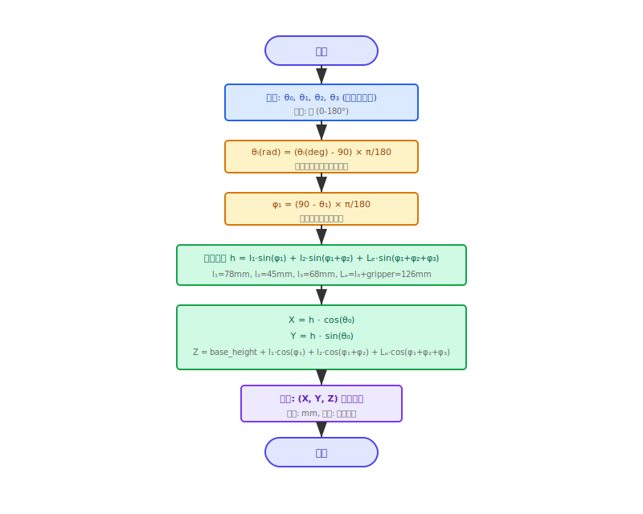

- **正运动学**：关节角度 → 末端执行器位置
- **逆运动学**：末端执行器位置 → 关节角度（几何法 + 姿态配置偏好）
  - **GRASP_A**：J2>90°（肘部向前），J3<90°（腕部向前），适合从上方向下抓取
  - **GRASP_B**：J2<90°（肘部向后），J3>90°（腕部向后），适合从下方向上抓取
  - **KINEMATIC_ANY**：任意有效解，首个匹配即返回

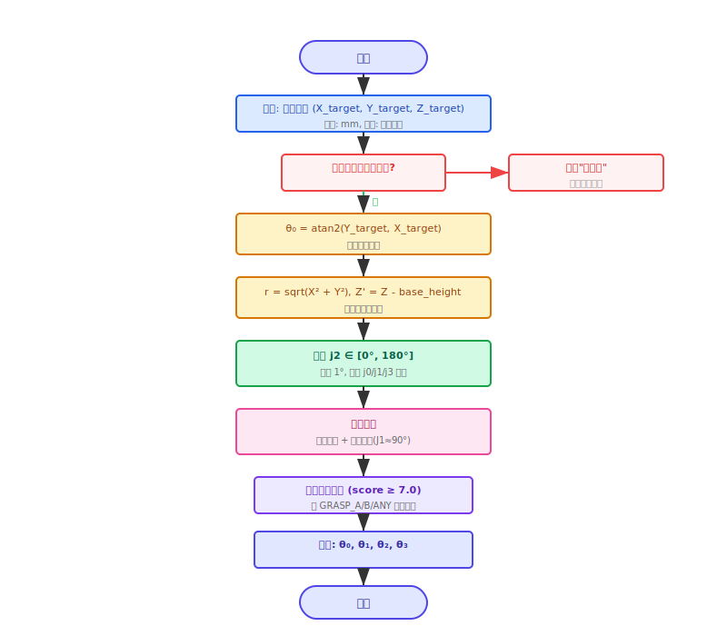

- **迭代逆运动学 (Iterative IK)**：基于雅可比矩阵的数值迭代求解器，适用于复杂姿态配置（可配置最大迭代次数和收敛容差）

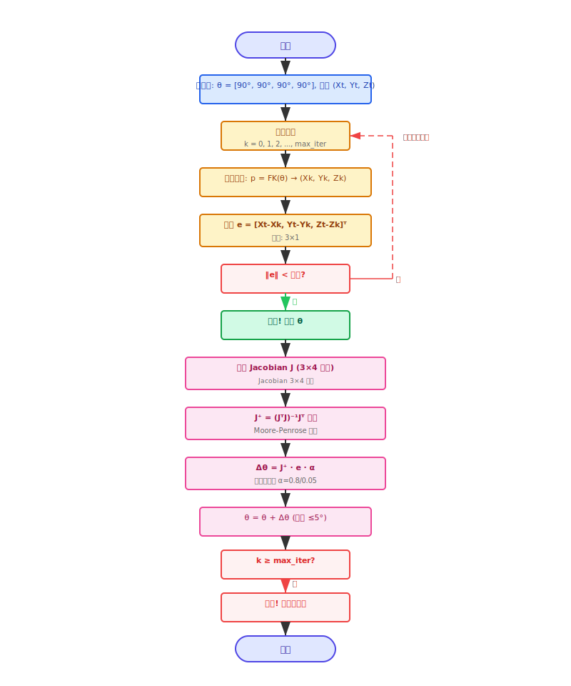

### 工作空间

- 最大伸展半径：l1 + l2 + l3 + gripper_length = 249mm
- 最大伸展高度：319mm
- 超出工作空间的坐标会被拒绝并打印警告日志

## 常见问题与排查

### 1. 舵机不响应 / 无反应

**可能原因**：
- I2C 总线通信失败（SDA/SCL 接线松动或接反）
- PCA9685 未正确初始化（I2C 地址错误）

**排查步骤**：
1. 检查串口日志是否有 `PCA9685_Init failed` 或 `Servo_SetAngle failed` 报错
2. 确认 SDA=GPIO51、SCL=GPIO52 接线正确
3. 用万用表测量 I2C 总线是否有上拉电阻（通常 4.7kΩ-10kΩ）
4. 确认 PCA9685 的 AD0 引脚接地（地址 0x40），若接 VCC 则为 0x41

### 2. MPU6050 检测不到

**可能原因**：
- AD0 引脚电平配置错误
- I2C 总线冲突（与 PCA9685 共享总线时地址不同，应无冲突）

**排查步骤**：
1. 检查串口日志：`MPU6050 not connected at 0x68, trying 0x69`
2. 若 0x68 失败自动尝试 0x69，说明 AD0 引脚接了高电平
3. 确认 MPU6050 的 VCC/GND 供电正常（3.3V）
4. 若两块板子都检测不到，检查 I2C 接线

### 3. 体感控制时底座剧烈甩动

**可能原因**：
- 手机陀螺仪在 ±90° 附近出现符号翻转（-89° → +89°），导致底座角度跳变
- 系统内置了 Δ-limiter 机制（跳变 >170° 时丢弃），但如果手机放置方式不当仍可能发生

**解决方法**：
1. 确保手机平放时 roll ≈ 0°（水平放置）
2. 在手动模式下先用 `servo0` 滑块将底座调到合适位置
3. 切换回 IMU 模式后，保持手机姿态平稳，避免快速大幅度晃动

### 4. 夹爪抓取时物品掉落

**可能原因**：
- 夹爪闭合力度不足（舵机角度未达到 90°）
- 末端姿态偏差导致物品重心偏移
- PID 闭环未生效

**排查步骤**：
1. 用 `gripper_close` 命令确认夹爪完全闭合
2. 检查 PID 模式下 `pid_pitch_error` 和 `pid_pitch_output` 日志，确认闭环在工作
3. 确认物品重量不超过夹爪承重范围
4. 检查夹爪机械结构是否磨损或变形

### 5. 逆运动学求解失败（"不可达"）

**可能原因**：
- 目标坐标超出工作空间（高度 >319mm 或水平距离 >249mm）
- 目标点位于奇异点附近（多个关节共线）

**排查步骤**：
1. 检查目标坐标是否在合理范围内
2. 尝试使用 `kmove` 命令输入更接近机械臂当前位置的坐标
3. 日志会打印 `Out of reach` 或 `No valid solution` 帮助定位

### 6. WiFi 连接不稳定

**可能原因**：
- ESP32-C5 协处理器固件未正确加载
- SDIO 通信链路不稳定

**排查步骤**：
1. 检查串口日志是否有 `WiFi AP started` 信息
2. 确认 C5 固件已烧录（`idf.py set-target esp32c5 && idf.py build`）
3. 确认 SDIO 引脚连接可靠（GPIO13-19），接触不良会导致 WiFi 断连
4. 尝试缩短手机与设备的距离

### 7. 编译失败

**可能原因**：
- ESP-IDF 版本不匹配
- 组件依赖未安装

**排查步骤**：
1. 确认 ESP-IDF 版本为 v5.5.4
2. 运行 `reconfigure.bat` 重新安装组件依赖
3. 清理旧构建产物后重试：`rm -rf build/ && idf.py reconfigure`

## 许可证

本项目采用 [MIT 许可证](./LICENSE)。
